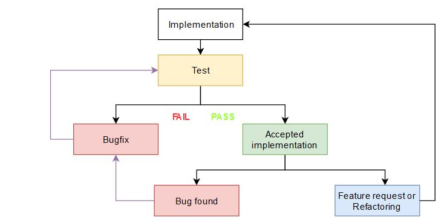
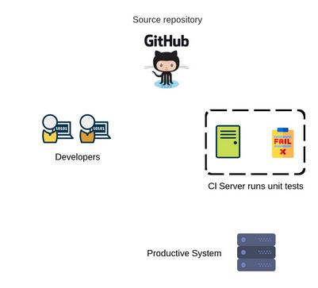
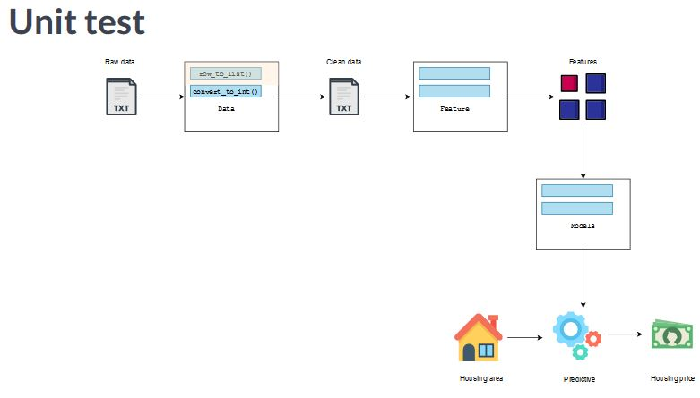
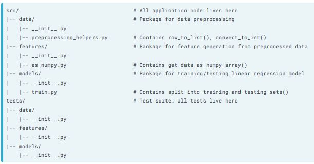
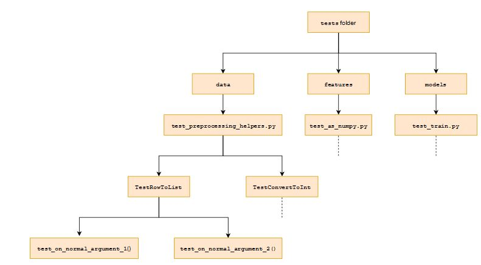

# Unit testing in Python for Data Science
- Every data science project needs unit testing. It comes with huge benefits - saving a lot of development and maintenance time, improving documentation, increasing end-user trust and reducing downtime of productive systems. As a result, unit testing has become a must-have skill in the industry, used by almost every company. 
- Unit tests for data preprocessors, models and visualizations, interpret test results and fix any buggy code. We will also learn advanced concepts like TDD, test organization, fixtures and mocking so that you can test your own data science projects properly.

### Unit testing basics

#### Why Unit test?
- How can we test an implementation of pythton function is correct? The easiest way is to open the interpreter and pass few arguments and check whether the return value is correct. Testing on interpreter is easy but its very inefficient.

#### Life cycle of a function

<p align="center">
  
</p>

- Notice how many times we need to test the function, either to fix bugs or to implement new features, we have to test it everytime we have to test it. If a project continues for few years we might be testing the function about a 100 times, maybe more.

#### Manual test vs. Unit tests
- Unit tests automates this repetitve and tedious testing process.


### Write a simple unit test using pytest
- There are many python libraries to write unit tests such as pytest, unittest, nosetests and doctest. Pytest has all essential features and most popular testing library in Python.
- *Step 1*: Create a file called `test_row_to_list.py`
- When pytest sees a filename starting with **"test_"** , it understands that this is not an usual Python file, but a special one containing unit tests.We must make sure to follow this naming convention. Files holding unit tests are also called test modules.

```python
# test module
import pytest
import row_to_list   # import function under test
```

- A unit test is written as a Python function, whose name starts with a "test_", just like the test module. This way, pytest can tell that it is a unit test and not an ordinary function.
- The unit test usually corresponds to exactly one entry in the argument and return value table for `row_to_list()`. The unit test checks whether `row_to_list()` has the expected return value when called on this particular argument.

```python
def test_for_clean_row():
    assert row_to_list("2,081\t314, 942\n") == ["2,081", "314,942"]
    
def test_for_missing_area():
    assert row_to_list("\t293,410\n") is None
 
def test_for_missing_tab():
    assert row_to_list("1,463238, 765\n") is None
```

- This particular argument is a clean row, so we call the unit test test_for_clean_row(). The actual check is done via an assert statement, and every test must contain one.

#### Theoretical structure of an assertion

`assert boolean_expression`

- The assert statement has a required first argument, which can be any boolean expression. **If the expression is True, the assert statement passes, giving us a blank output. If the expression is False it raises an AssertionError.**
- **1)** In this case, we want to check if row_to_list() returns the correct list when called on the clean row.
- **2)** Second we create a test called `test_for_missing_area()` because the argument has missing area data. Then we assert that the return value for this argument is None.
- **3)** Third we create `test_for_missing_tab` because the argument is missing the tab separating area and price.

#### Running unit tests
- To test whether `row_to_list()` is working in its life cycle, we simply run the test module. The standard way to run tests is to open a command line and type pytest followed by the test module name.
- **`!pytest test_module.py`**

```python
 D:\Projects\Datacamp\Unit Testing in Python for Data Science\test_modules>pytest test_preprocessing_helpers.py
====================================================================================== test session starts ====================================================================================== 
platform win32 -- Python 3.7.3, pytest-4.3.1, py-1.8.0, pluggy-0.9.0
rootdir: D:\Projects\Datacamp\Unit Testing in Python for Data Science\test_modules, inifile:
plugins: remotedata-0.3.1, openfiles-0.3.2, doctestplus-0.3.0, arraydiff-0.3
collected 1 item                                                                                                                                                                                  

test_preprocessing_helpers.py .                                                                                                                                                            [100%] 

=================================================================================== 1 passed in 0.03 seconds ==================================================================================== 
```

### Understanding test result report

- test result of **test_row_to_list.py**

```python
(base) D:\Projects\Datacamp\Unit Testing in Python for Data Science\test_modules>pytest test_row_to_list.py
====================================================================================== test session starts ======================================================================================
platform win32 -- Python 3.7.3, pytest-4.3.1, py-1.8.0, pluggy-0.9.0
rootdir: D:\Projects\Datacamp\Unit Testing in Python for Data Science\test_modules, inifile:
plugins: remotedata-0.3.1, openfiles-0.3.2, doctestplus-0.3.0, arraydiff-0.3
collected 3 items

test_row_to_list.py FF.                                                                                                                                                                    [100%]

=========================================================================================== FAILURES ============================================================================================ 
______________________________________________________________________________________ test_for_clean_row _______________________________________________________________________________________ 

    def test_for_clean_row():
>       assert row_to_list("2,081\t314, 942\n") == ["2,081", "314,942"]
E       AssertionError: assert ['2,081', '314', ' 942'] == ['2,081', '314,942']
E         At index 1 diff: '314' != '314,942'
E         Left contains more items, first extra item: ' 942'
E         Use -v to get the full diff

test_row_to_list.py:6: AssertionError
_____________________________________________________________________________________ test_for_missing_area _____________________________________________________________________________________ 

    def test_for_missing_area():
>       assert row_to_list("\t293,410\n") is None
E       AssertionError: assert ['', '293', '410'] is None
E        +  where ['', '293', '410'] = row_to_list('\t293,410\n')

test_row_to_list.py:9: AssertionError
============================================================================== 2 failed, 1 passed in 0.14 seconds =============================================================================== 
```

| Character| Meaning | When                                           | Action                         |
:---------:|:-------:|:----------------------------------------------:|:------------------------------:|
| *F*      | Failure |An exception is raised when running unit test   |Fix the function or unit test   |
| *.*      | Passed  |No exception raised when running unit test      |Everything is fine              |

- If we get an AssertionError, this means the function has a bug and you should fix it. If you get another exception, e.g. NameError, this means that something else is wrong with the unit test code and you should fix it so that the assert statement can actually run.

### More benefits and tests types

#### Unit tests serve as documentation
- This is why - when onboarding new colleagues - it is a good idea to tell them to look at the unit tests if they are not sure about a function's purpose. 

#### More trust
- Unit tests also increase trust in a package, as users can run the unit tests and verify that the functions work.

#### Reduced Downtime

<p align="center">
  
</p>

- Suppose we make a mistake and push a bad code to a productive system. This will bring the system down and annoy the users. We can cure this by setting up Continuos Integration or CI. 
- **CI** runs all unit tests when any code is pushed, and if any unit test fails, it rejects the change, preventing downtime. It also informs us that the code needs to be fixed.
- If we run productive systems that many people depend upon, we must write unit tests and setup CI.

<p align="center">
  
</p>

- We will write unit tests for all functions in the example linear regression project. We already wrote tests for `row_to_list()` and `convert_to_int()`. They are part of the data module, which creates a clean data file from raw data on housing area and price. We will also see functions from the feature module, which compute features from the clean data. Also the models module, which will output a model for predicting housing price from the features.These are called **Unit test**.
- In contrast, **Integration tests** check if multiple units work well together when they are connected, and not just independently. FOr example, we could check if the data and the feature module work well when connected. Here the argument will be the raw data, and the return values to check would be the features.
- **End to End tests** check the whole software at once. They start from one end, which is the unprocessed data file, goes through all the units till the other end, and checks whether we get the correct model.

### Mastering assert statements 
- So far we have used only a boolean expression as an argument of the assert statement. But the assert statement can take an optional second argument, called the **message**. 
- `assert boolean_expression, message`
- The message is only printed when the assert statement raises an AssertionError and it should contain information about why the AssertionError was raised.**If the assert statement passes, nothing is printed** 
- We could enhance `test_for_missing_area` by adding a messsage

```python
import pytest
....

def test_for_missing_area_with_message():
    actual = row_to_list("\t293, 410\n")
    expected = None
    message = ("row_to_list('\t293, 410\n') returned{0} instead of {1}".format(actual, expected))
    assert actual is expected , message
```

- Now we get nice human readable message tet next to the AssertionError

```python
>       assert actual is expected , message
E       AssertionError: row_to_list('   293, 410
E         ') returned['', '293', ' 410'] instead of None
E       assert ['', '293', ' 410'] is None
```

#### Beware of float return values!
- A tricky situation when the function returns a float. In python, comparisons between floats dont always work as expected.
- `0.1 + 0.1 + 0.1 == 0.3` -->> outputs `False`
- Because of the way Python represents floats, the digits on the right might be different from what we expect causing comparisons to fail.
- `0.1 + 0.1 + 0.1` -->> outputs `0.3000000000004`
- The bottom line is : we should not use the usual way to compare floats in the assert statement. Instead we should use the **`pytest.approx()`** to wrap the expected value.
- `assert 0.1 + 0.1 + 0.1 == pytest.approx(0.3)`

#### Numpy arrays containing floats
- pytest.approx() also works for numpy arrays containing floats.
- `assert np.array([0.1 + 0.1, 0.1 + 0.1 + 0.1]) == pytest.approx(np.array([0.2, 0.3])`

#### Multiple assertions in one unit test
- So far, we have only seen one assert statement per unit test, but unit tests can have more than one assert statement.We will modify the unit test `test_convert_to_int.py`
- We first wanted to test if the function returns an integer at all.For this, we use the `isinstance()` function, which takes the return value as a first argument and the expected type of the return value as a second argument, which is int in this case.We follow up with another assert statement which checks if the return value matches the expected value.
- The modified test will pass if both assertions pass. It will fail if any of them raises AssertionError.

```python
import pytest

def test_on_string_with_one_comma():
    return_value = convert_to_int("2,018")
    assert isinstance(return_value, int)
    assert return_value == 2018
```

### Testing for exceptions instead of return values
- We have used the assert statement to check if a function returns the expected value. However, some functions may not return anything, but rather raise an exception, when called on certain arguments.

```python
import numpy as np
example_argument = np.array([[2081, 314942],
                            [1059, 186606],
                            [1148, 206186],])
split_into_training_and_testing_sets(example_argument)
```

- This function returns a two-tuple containing the training and the testing array. It puts 75% of the rows of the argument Numpy Array into the training array, and the rest of the rows into the testing array. This function expects the argument array to have rows and columns, that is, the argument array must be two dimensional. Otherwise, splitting by rows is undefined.
- So if we pass a one dimensional array to this function, it should not return anything, but rather raise a ValueError, which is a specific type of exception.  
- Goal : test whether the function raises a ValueError when it gets a one dimensional array as argument.

```python
def test_valueerror_on_one_dimensional_argument():
    example_argument = np.array([2081, 314942, 1059, 186606, 1148, 206186])
    with pytest.raises(ValueError):
        split_into_training_and_testing_sets(example_argument)
```

#### Theoretical structure of a with statement

```python
with context_manager:
    print("This is a part of the context") # any code inside is the context
```

- The with statement takes a single argument, which is known as a context manager. The context manager runs some code before entering and exiting the context. In this case we are using a context manager called pytest.raises()
- It takes a single argument, which is the **type of exception** that we are checking for, in this case, a ValueError. This context manager does not run any code on entering the context, but it does something on exit.
- If the code in the context raises a ValueError, the context manager silences the error.And if the code in the context does not raise a ValueError, the context manager raises an exception itself.

```python
with pytest.raises(ValueError):
    raise ValueError    # context exits with ValueError
    # <-- pytest.raises(ValueError) silences it
```

- Here is an example where a ValueError is raised in the context and silenced by the context manager.

```python
with pytest.raises(ValueError):
    pass # context exxits without raising a ValueError
    # <-- pytest.raises(ValueError) raises Failed
```

- The second code block shows an example where no ValueError is raised and the context manager raises an exception called Failed.

#### Unit testing exceptions
- Getting back to the unit test, we call the function on the one dimensional array inside the context.
- If the function raises a `ValueError` as expected, it will be silenced and the test will pass.
- If the function is buggy and no `ValueError` is raised, the context manager raises a Failed exception, causing the test to fail.

#### Testing the error message
- We can unit test details of the raised exception as well.For e.g we might want to check if the raised ValueError contains the correct error message which starts with "Argument data array must be two dimensional". 
- Inorder to do that, we extend the with statement with the as clause.If the value error is raised within the context, then exception_info will contain the information about the silenced ValueError. 
- After the context ends, we can check whether `exception_info` has the correct message.To do this, we use a simple assert statement with the match() method of `exception_info`. The match method takes a string as argument and checks if the string is present in the error message.

```python
def test_valueerror_on_one_dimensional_argument():
    example_argument = np.array([2081, 314942, 1059, 186606, 1148, 206186])
    with pytest.raises(ValueError) as exception_info:   # store the exception
        split_into_training_and_testing_sets(example_argument)
        
    # check if ValueError contains correct message
    assert exception_info.match("Argument data array must be 2 dim.Got 1 dim array instead")
```

### The well tested function
- How many tests should one write for a function ? Consider the `split_into_training_and_testing_sets` function, it takes a 2-D numpy array as an argument and randomly puts about 75% of the rows into a training array, and the remaining rows into a testing array. It returns the training and testing array as a tuple with these 2 arrays.
- Because this function has randomness, we test for the lengths of the training and testing arrays rather than their actual values. The length of the training array is given by the integer part of 0.75 times the number of rows in the argument. The testing array gets the rest.
- In general, the more arguments we check the more confident we can be that the function is working correctly.But since we cant write test for 100 of arguments because of time limitations, how many tests can be considered enough ?

#### Test argument types
- The best practise is to pick a few from each of the following categories of arguments, which are called **bad arguments, special arguments and normal arguments**
- If we have tested all of these argument types then our function can be declared well tested.

##### Type I : Bad arguments
- Bad arguments are arguments for which the function raises an exception instead of returning a value. For split_into_training_and_testing_sets(), 1-d array is a bad argument. The expected outcome is a ValueError. `e.g np.array([845.0, 310360, 1291.0, 72205.0])`
- An array with a single row is also a bad argument, because this row can be put into the training array, but then the testing array will be empty.

##### Type II : Special arguments
- These are two types: `boundary values` and `argument values` for which the function uses a special logic to produce the return value. What are boundary values? If we look at the number of rows of the argument, we see that the fucntion raises a ValueError for one row, but returns training and testing array for arguments having more than one row. The value two marks a boundary for this behaviour change, and therefore is a boundary value.
- The other type of special arguments are those that trigger special logic in the function. Argument containing 4 rows, the standard logic of 75% and 25% split would produce a training array with 3 rows and a testing array with 1 row. But we might want the function to return a training array with 2 rows and testing array with 2 rows instead. Then 4 rows would be a special case, because the function isnt using the usual 75% and 25% logic.
- Finally, anything that is not a bad or special argument is a normal argument.

### Test Driven Development (TDD)
- New coding method : TDD which tries to ensure that unit tests do get written. Normally a function is first written and then tested. TDD alters the usual life cycle by adding a single step before implementation. This step involves writing unit tests for the function.

#### Write unit tests before implementation!
- Write unit tests even before function is implemented in code. By making unit tests a precondition for implementation, this ensures that writing unit tests cannot be postponed or deprioritized.
- Time for writing unit tests factored in implementation time.
- Furthermore, when we write unit tests first, we have to think of possible arguments and return values- which includes normal, special and bad arguments. This type of thinking before implementation actually helps in finalizing the requirements for a function. When the requirements for a function is clear and precise, it makes the implementation much easier.

##### Step 1 : Write unit tests and fix requirements
- First, write the tests for this function in the test module `test_convert_to_int.py`. As we write the unit tests, we will think more about the requirements of this function.

##### Step 2 : Run tests and watch it fail
- Execute the test module, the tests will not pass because the function does not even exists yet.

##### Step 3 : Implement the function and run tests again
- If the function implemented correctly then the test should pass this time.

### How to organize a growing set of tests?
- As the number of unit tests keeps growing we would need a strategy to keep all these tests organized.

<p align="center">
  
</p>

- The developers of pytest recommend that we create a directory called tests at the same level as src. This directory is also called the test suite. Inside this folder, we simply mirror the inner structure of src and create empty packages called data, features and models respectivey.

#### Python module and test module correspondence
- The general rule is that for each python module `my_module.py`, there should be a corresponding test module called `test_my_module.py` . For e.g, for the module `preprocessing_helpers.py` , we create a test module called `test_preprocessing_helpers.py`. Since `preprocessing_helpers.py` belongs to the data package, we put the corresponding test module in the mirrored package inside the tests directory.
- The mirroring in the directory structure and test module names ensure that if we know where to find application code, we can follow the same route inside the test directory to access corresponding tests.
- The test module `test_preprocessing_helpers.py` should contain tests for `row_to_list()` and `convert_to_int()`. We can put all the tests in sequentail manner, but that's very complex. 

#### Test class
- pytest solves the problem of complex sequential tests using a construct called the test class.

#### Test class is a container for a single unit's tests
- A test class is just a simple container for tests of a specific function.

#### Test class : theoretical structure
- the name of the class should be in CamelCase, and should always start with "Test".
- the best way to name a test class is to follow the "Test" with the name of the function, for example, TestRowToList
- A test class takes one argument, and this argument is always called **object**.
- Now put all test for the function under the test class. Note that, this time, all tests should receive a single argument called **self**.

```python
import pytest
from data.preprocessing_helpers import row_to_list, convert_to_int

class TestRowToList(object):  # always put the argument object
    def test_on_no_tab_no_missing_value(self):  # a test for row_to_list()
        ...
        
    def test_on_two_tabs_no_missing_value(self): # another test for row_to_list()
        ...

class TestConvertToInt(object):  # test class for convert_to_int()
    def test_with_no_comma(self): # a test for convert to int
        ...
        
    def test_with_one_comma(self):  # another test for convert_to_int()
        ...
```

### Mastering test execution
#### Test organization
- The centerpiece was the **tests folder**, which holds all tests for the project. The folder contains mirror packages, each of which contains a **test module**. The test modules contain many **test classes**. A test class is just a container for **unit tests for a particular function**.
        
<p align="center">
  
</p>    
 
#### Running all tests
- pytest provides an easy way to run all tests contained in the tests folder.We simply change to the tests directory and run the command **pytest**.

```python
cd tests
pytest
```

- This command automatically discovers tests by recursing into the subtree of the working directory. It identifies all files with names starting with "test_" as test modules. Within test modules, it identifies classes with names starting with "Test" as test classes.
- Within each test class, it identifies all functions with names starting with "test_" as unit tests. It collects these unit tests and runs them all.
     
#### Typical scenario : CI server
- A typical scenario to run this command is in a CI server after a commit is pushed to the code base.In this case, we are only interested in the binary question: do all unit tests pass after including the commit?

#### The -x flag : stop after first failure
- Adding the **`-x flag`** to the pytest command can save time and resources.This flag makes pytest stop after the first failing test, because a failing test already answers the binary question.

#### Running subset of tests
- Very often, we would only want to run a subset of tests. Just type pytest followed by the path to the module. `pytest data/test_preprocessing_helpers.py`. This only runs the 13 tests contained in test_preprocessing_helpers.

#### Node ID
- During automatic test discovery, pytest assigns a node ID to every test class and unit test that it encounters.
- Node ID of the test class : `<path to test module>::<test class name>`
- Node ID of an unit test   : `<path to test module>::<test class name>::<unit test name>`

#### Running tests using Node ID
- Run test class `TestRowToList` --> `pytest data/test_preprocessing_helpers.py::TestRowToList`
- When we run the command pytest followed by the node ID of the test class TestRowToList, it only runs the 7 tests contained in TestRowToList.
- When we run the command with the node ID of the unit test `test_on_one_tab_with_missing_value()`, it only runs a single test. --> `pytest data/test_preprocessing_helpers.py::TestRowToList::test_on_one_tab_with_missing_value`

#### Running tests using keyword expressions
- A faster and flexible way to do this is by using keyword expressions.

##### The -k option : pytest -k "pattern"
- To run tests using keyword expressions, use the -k option. This option takes a quoted string containing a pattern as the value. For example, we can specify a test class such as `TestSplitIntoTrainingAndTestingSets` as the pattern, and this will run only the 2 tests within that test class.
- We can also enter only part of the test class name, as long as that is unique. `pytest -k "TestSplit"`. This saves a lot of typing and has the same outcome.

#### Supports Python logical operators
- We can even use Python logical operators in the pattern to do more complex subsetting.For eg.,the following command will execute all tests in TestSplitIntoTrainingAndTestingSEts except the unit test test_on_one_row(), which only leaves one test to run.
- `pytest -k "TestSplit and not test_on_one_row"`

### Expected failures and conditional skipping

#### Implementing a function using TDD
- `train_model()` : Returns best fit line given training data
- Since we are using TDD, the first step is to write tests, so we create a test class TestTrainModel and add a test to it.

```python
import pytest

class TestTrainModel(object):
    def test_on_linear_data(self):
    ...
```

- If we run pytest, this test will fail because the function `train_model()` is not yet implemented.This is just a result of using TDD, it doesnt indicate problem with the code base.

#### False alarm
- But the CI server does not know this and will set off a false alarm when that test fails. It would be nice to have a way to tell pytest that we except this test to fail. We do that using the `xfail` decorator.

#### xfail : marking tests as "expected to fail"
- The decorator goes on top of a test, and starts with @.This is followed by the name of the decorator `pytest.mark.xfail`. After adding the decorator, if we run pytest again, we see that one test is xfailed. But there are no reported errors.

```python
import pytest

class TestTrainModel(object):
    @pytest.mark.xfail
    def test_on_linear_data(self):
        ...
```

#### Expected failures, but conditionally
- In some cases, we know that test fails only under certain consitions, and we dont want to be warned about them.Common situations are when some function wont work under a particular python version or a particular platform.

#### skipif : skip tests conditionally
- To tell python to skip running the test we need `skipif` decorator. The name of the decorator is `@pytest.mark.skipif(boolen expression)`. It takes a single boolean expression as argument. If the boolean expression is True, then the test will be skipped.
- import and use the module sys to check python version

```python
import sys

class TestCOnvertToInt(object):
    @pytest.mark.skipif(sys.version_info > (2,7), reason="requires Python 2.7")
    def test_with_no_comma(self):
        ...
```
- Showing reason in the test result report --> `pytest -r`


    
    
    
    
    


                    


    
    
    
    
    
    
    
    
    
    
    
    


